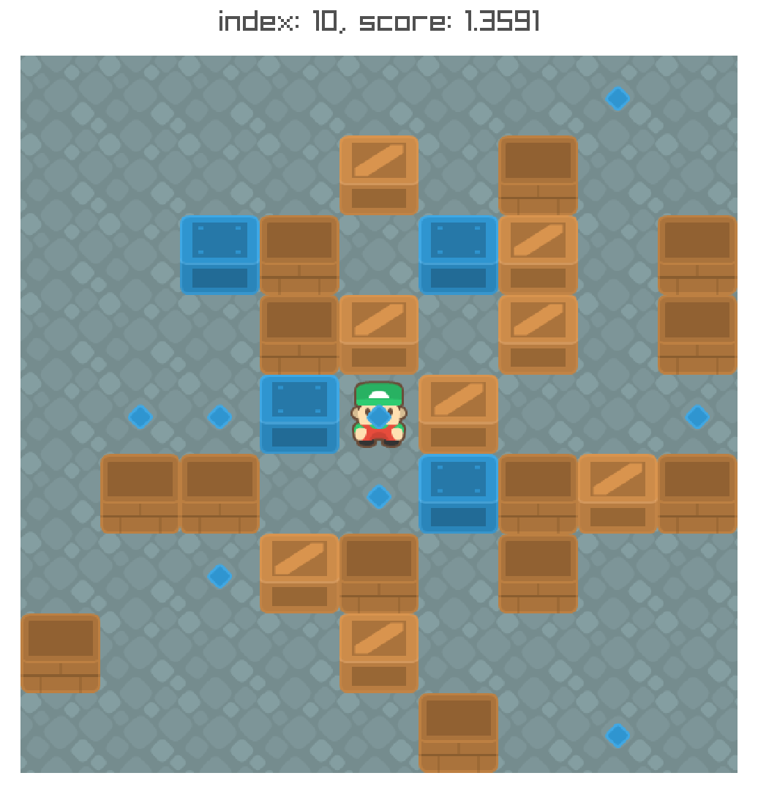

- [Project](#Project)
- [Build](#Build)
- [Usage](#Usage)
- [Controls](#Controls)

<!---  -->


# Project

This project is a sokoban level generator based off of 
*Data Driven Sokoban Puzzle Generation with Monte Carlo Tree Search* (https://ojs.aaai.org/index.php/AIIDE/article/view/12859, doi: https://doi.org/10.1609/aiide.v12i1.12859 ). 


The algorithm has been enhanced in many ways in this project.

The level generator manages to produce multiple highly evaluated levels in a short amount of time. Very high results are already being produced at ~1s.

Third Party (see third_party_licenses):

* Raylib v4.5 is being used for the gui (./include, ./lib, ./raylib.dll).
* Kenney's assets for the textures (./textures)

See _settings.h_ for adjusting the level generation (size, start position, cutoffs etc.)

# Build
SCons is being used for building the program.
It can be installed through
```
python -m pip install scons
```
(see https://scons.org/doc/production/HTML/scons-user/ch01s02.html)

c++17

Linux: gcc

Windows: msvc


To compile the program (Executable is named 'prog')

```
scons
```

There are 7 flags:
|Flag          | Options | _
|---------------------------|--------------------|--------------------|
| run | (0, 1) | run the program after successfully compiling
| o | (0, 1, 2, 3) | optimization level (o=3 leads to no issues)
| debug_symbols | (0, 1) | 
| debug | (0, 1) | extra checks inside the program
| no_raylib | (0, 1) | disable/enable linking against raylib
| asan | (0, 1) | address sanitizer
| profiler | (0, 1) | perf data

For settings in regards to the level generation see settings.h

Example:

```
scons run=1 o=3 debug_symbols=0
```

# Usage

The program will generate its levels and open up a playable GUI.

Levels can be loaded from ./saved_levels as follows
```
./prog load 3489735467
```

# Controls
Keybinds:
|Key                   | _  
|--------------------|-----------------------|
| 1, 2           | Switch between levels |
| r                | Reset |
| w, a, s, d | Movement |
| Scroll           | Zoom |
| k                | Save level in ./saved_levels |
| p                | Save a .png file of the level in ./__images |
| F11              | Toggle Fullscreen |
| Escape           | Terminate |


